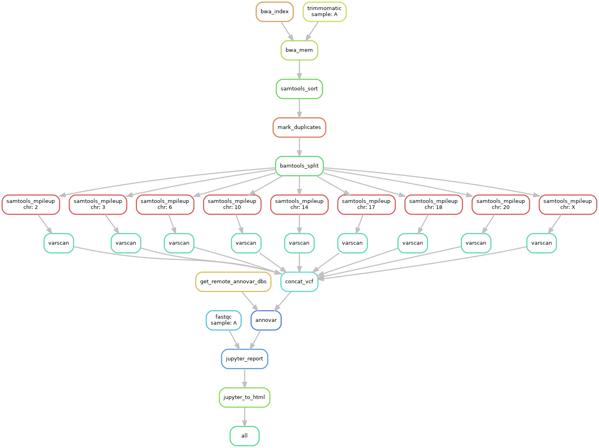

# Diagnostic Genome Analysis - A Snakemake Pipeline

This pipeline uses Snakemake to chain various genomic dataprocessing tools, with the goal of finding significant  
genomic variants, and exhibiting them in a Jupyter Notebook.



## Getting Started

To get a copy of the pipeline it is recommended you clone this repository (Dataprocessing with Snakemake),   
install the prerequisites, and setup the config variables. The following steps will guide you through this 
process. 

### Prerequisites

The pipeline requires a number of Python packages and genomic analysis tools to be installed locally.  
In addition to this the optionally provided Jupyter Notebook template will require some secondary Python packages.

For input the pipeline currently only support paired-end read samples. You will have to provide these, in addition  
to a reference genome. 

##### Required pipeline tools to be installed / present locally:
- Snakemake - [Link](https://snakemake.readthedocs.io/en/stable/)
- FastQC - [Link](https://www.bioinformatics.babraham.ac.uk/projects/fastqc/)
- Trimmomatic - [Link](http://www.usadellab.org/cms/?page=trimmomatic)
- Burrows-Wheeler Alignment Tool (BWA) - [Link](http://bio-bwa.sourceforge.net/bwa.shtml)
- Samtools - [Link](http://www.htslib.org/)
- Picard - [Link](https://broadinstitute.github.io/picard/)
- Bamtools - [Link](https://github.com/pezmaster31/bamtools)
- Varscan - [Link](http://varscan.sourceforge.net/)
- Annovar - [Link](http://annovar.openbioinformatics.org/en/latest/user-guide/download/)

##### Required Python packages:
- Jupyter - [Link](https://jupyter.org/) or ```pip3 install jupyter```

##### Additional packages required for provided Jupyter Notebook template: 
- Pandas - ```pip3 install pandas```
- Numpy - ```pip3 install numpy```
- Plotly - ```pip3 install plotly```

### Setting up the config variables
Before running the pipeline you will have to specify a number of variables, such as paths to the locally installed  
tools, samples, and reference genome. These variables can be found in the ```config.yaml``` file.  

The config file offers flexibility to some extend (see adjusting the pipeline, however, for the pipeline to run you  
will have to, at least, supply absolute or relative paths to your tools, reference genome, and paired-end read samples.

***Note:*** *Samples will require a special type of formatting, in the form of*  ```sample_[R1/R2].fastq```
*where* ```[R1/R2]```  *refers  
to your forward or reverse read files respectively. The file path entered in ```config.yaml```
will then simply be* ```/your_sample``` *,  
the pipeline will handle the file   extensions.*

## Running the pipeline
After all dependencies are met it is time to test the pipeline. It is recommended you perform a dry-run of the pipeline  
before starting analysis on genomic samples. This can be achieved by entering the following command:  

```snakemake -n```  

If the dry run completes without error you may enter the following command to start variant analysis of your genomic  
samples:

```snakemake -R all --cores <your_cores>```  

This will take some time depending on the size of your samples, reference genome, cores available, and whether or not  
this is the first time you are running the pipeline. If no errors occur the pipeline output can be found under:

```runs/<your_sample>```.

## Adjusting the pipeline
This pipeline was designed with some degree of scaling in mind. Therefore there are a number of things you can tweak  
in the config file or pipeline rules themselves, for further optimizations.  

- In ```config.yaml``` you may dictate the chromosomes you wish to perform analysis on, meaning reads of chromosomes that  
are not of interest to your analysis will not be processed any further. 
- In ```config.yaml``` you may specify the Annovar databases you wish to annotate with, these are automatically downloaded  
when running the pipeline. Just make sure the file names referred to in config.yaml are in line with the database files.  
- In ```config.yaml``` you may reserve a thread for the downloading of Annovar databases. As the downloading of these  
databases will most likely be bandwidth or I/O limited you can reserve a thread to perform this action. The rest of the  
pipeline will continue processing as usual until reaching the Annovar processing step. 
- Depending on your sample and reference genome sizes, it might be beneficial to experiment changing the threads reserved  
for various rules.  